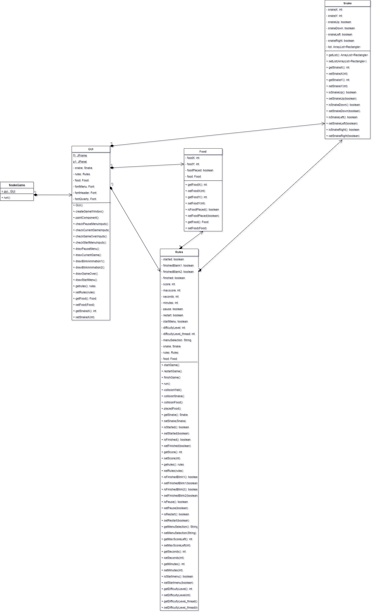

# Snake Game (GUI Java)

This repository is a final project (Java GUI) from Object-Oriented Programming Class, Teknik Informatika Universitas Padjadjaran. 

[Challenge Guidelines](challenge-guideline.md)

**Project Snake Game (GUI Java) Ini jadi terinspirasi dari game classic yang sudah ada dari zaman dulu, yaitu Game Snake. Ini merupakan salah satu game yang sangat terkenal
   dan klasik. Kita Menggunakan GUI Java dengan Memanfaatkan Swing dan konsep OOP.**

## Credits
| NPM           | Name        |
| ------------- |-------------|
| 140810190006  | M.Fadlan F. |
| 140810190022  | M.Diva E.A  |
| 140810190030  | Azhar J.U   |

## Change log
- **[Sprint Planning](changelog/sprint-planning.md) - (17 Nov)** 
   - First Scrum Meeting And Sprint Planning About The Project

- **[Sprint 1](changelog/sprint-1.md) - (date from 16 Nov until 22 Nov)** 
   - Creating The Basic User Interface
   - Creation Of The Board And Logic Of The Game
   - Implementing Object Oriented Programming
   - Creating The Snake
   - Make Sure That The Snake Will Be Appear In The Board

- **[Sprint 2](changelog/sprint-2.md) - (date from 23 Nov until 29 Nov)** 
  - Implementing Keyboard Input 
  - Implementing Movement Of The Snake 
  - Implementing The Food 
  - Creating The Timer 
  - Creating The Score 
  - Make Sure Everything Is Okay 
   
- **[Sprint 3](changelog/sprint-3.md) - (date from 30 Nov until 5 Des)** 
  - Implementing Gameover And Restart 
  - Beautify The Board And User Interface
  - Final Testing 
  - Recover Bug 
  - Make Sure The Game Is Ready To Play 
  - Implementation Of Optional Backlog (If Possible)

## Running The App

- Untuk menjalankan cukup dengan mencompile terlebih dahulu SnakeGame.java dan ketik java SnakeGame di command line.
- Lalu tinggal mainkan saja gamenya. Selamat mencoba

## Classes Used

### Kelas-Kelas yang dipakai
- Kelas SnakeGame, yang merupakan Main Class dari aplikasi ini
- Kelas Snake, yang merupakan class untuk membuat snake itu sendiri
- Kelas GUI, yang merupakan class yang digunakan untuk membuat tampilan GUI secara keseluruhan
- Kelas Rules, yang merupakan sebuah class untuk menetapkan peraturan atau logic dari aplikasi itu sendiri
- Kelas Food, yang merupakan sebuah class untuk makanan atau food yang dimakan oleh Snake.

## Notable Assumption and Design App Details

- Pengguna akan diberikan tampilan atau menu awal yang terdiri dari Start Game, Pilihan Difficulty (Easy,Medium,dan Hard), dan Exit Game. 
- Setelah pengguna menekan spasi di Start Game, ular muncul dengan panjang awal 5 sel dan posisi kepala ada ditengah-tengah area game.
- Ular akan mulai bergerak maju setelah pengguna masuk kedalam Start Game tadi.
- Dan juga setelah ditekan Start Game buah pertama akan muncul secara random.
- Jika buah termakan oleh ular, maka ular akan bertambah panjangnya pada bagian kepala sebanyak satu sel. Dengan kata lain, pada saat buah dimakan, buah tersebut berubah menjadi kepala baru ular.
- Jika game selesai, munculkan dialog baru untuk menampilkan score. 
- Pengguna diberikan dua pilihan , apakah restart atau exit game.
- Jika Restart, maka kembali ke permainan langsung tanpa melalui menu awal. Jika Exit, maka akan keluar aplikasi
